# terraform-eks-gitops-platform

Production-ready AWS EKS infrastructure with Terraform and GitOps deployment using ArgoCD. Features multi-AZ setup, EFS storage, and automated application delivery pipeline.

## Architecture Overview



This Terraform configuration deploys:

- **VPC** with public and private subnets across multiple AZs
- **EKS Cluster** with managed node groups
- **EFS** for persistent storage with CSI driver
- **Application Load Balancer Controller** for ingress management
- **ArgoCD** for GitOps-based application deployment
- **Weather Application** as a sample workload with persistent storage

## Project Overview

This project demonstrates a **Terraform-driven Infrastructure as Code** approach combined with **GitOps principles** to deploy and manage a production-grade Kubernetes platform on AWS EKS. The architecture showcases how to effectively separate infrastructure provisioning from application deployment while maintaining consistency, repeatability, and operational excellence.

### Terraform Infrastructure Management

- **Modular Architecture**: Reusable Terraform modules for VPC, EKS, EFS, and application components
- **State Management**: Remote state storage with S3 backend and DynamoDB locking
- **Multi-Environment Support**: Structured for dev/staging/prod environment promotion
- **Provider Integration**: Seamless integration between AWS, Kubernetes, and Helm providers
- **Dependency Management**: Proper resource dependencies and lifecycle management

### GitOps Workflow Implementation

- **ArgoCD Integration**: Automated application deployment and synchronization from Git repositories
- **Declarative Configuration**: Kubernetes manifests and Helm charts managed through version control
- **Continuous Reconciliation**: Automatic drift detection and self-healing capabilities
- **Progressive Delivery**: Support for canary deployments and rollback strategies
- **Multi-Tenant Ready**: Namespace isolation and RBAC for team-based deployments

### Use Cases

This implementation serves as a blueprint for:
- **Infrastructure teams** adopting Terraform for cloud resource management
- **Platform engineers** implementing GitOps workflows at enterprise scale
- **DevOps practitioners** seeking production-ready Kubernetes patterns
- **Organizations** transitioning from imperative to declarative infrastructure management
- **Teams** establishing CI/CD pipelines with infrastructure and application separation

## Prerequisites

Before deploying this infrastructure, ensure you have:

1. **AWS CLI** configured with appropriate permissions
2. **Terraform** >= 1.0 installed
3. **kubectl** installed for cluster management
4. **Helm** CLI for manual chart operations (optional)
5. **Domain name** registered and managed in Route 53 (or external DNS)
6. **SSL Certificate** provisioned in AWS Certificate Manager

### Required AWS Permissions

Your AWS credentials need permissions for:
- VPC and networking resources
- EKS cluster and node group management
- IAM roles and policies
- EFS file systems
- Application Load Balancers
- Secrets Manager
- Certificate Manager

## Quick Start

### 1. Configure Backend (Recommended)

Uncomment and configure the S3 backend in `backend.tf`:

```hcl
backend "s3" {
  bucket         = "your-terraform-state-bucket"
  key            = "prod/terraform.tfstate"
  region         = "eu-north-1"
  encrypt        = true
  dynamodb_table = "terraform-locks"
}
```

### 2. Create terraform.tfvars

Create a `terraform.tfvars` file with your specific values:

```hcl
# Basic Configuration
environment    = "prod"
project_name   = "weather-platform"
region         = "eu-north-1"
aws_account_id = "123456789012"

# Networking
cidr_block     = "10.0.0.0/16"
private_subnet = ["10.0.1.0/24", "10.0.2.0/24", "10.0.3.0/24"]
public_subnet  = ["10.0.101.0/24", "10.0.102.0/24", "10.0.103.0/24"]

# EKS Configuration
cluster_name         = "weather-platform-prod"
cluster_version      = "1.28"
node_instance_type   = "t3.medium"
desired_node_count   = 3
min_node_count       = 2
max_node_count       = 6

# EFS
efs_csi_driver_version = "v1.7.0"

# Application Configuration
namespace            = "weatherapp"
service_account_name = "weatherapp-sa"
alb_name            = "weather-platform-alb"

# Domain and SSL
domain_name     = "example.com"
certificate_arn = "arn:aws:acm:eu-north-1:123456789012:certificate/your-cert-id"

# Weather App Configuration
weather_app_git_repo         = "https://github.com/your-org/weather-app-helm.git"
weather_app_image_repository = "your-account.dkr.ecr.eu-north-1.amazonaws.com/weather-app"
weather_app_image_tag        = "v1.0.0"
weather_app_secret_name      = "weather-api-secret"
weather_api_key             = "your-weather-api-key"
weather_app_bg_color        = "#2196F3"

# Storage
pvc_size = "10Gi"
```

### 3. Deploy Infrastructure

```bash
# Initialize Terraform
terraform init

# Review the execution plan
terraform plan

# Apply the configuration
terraform apply
```

### 4. Configure kubectl

After deployment, configure kubectl to connect to your cluster:

```bash
aws eks update-kubeconfig --region eu-north-1 --name weather-platform-prod
```

## Configuration Variables

### Core Infrastructure

| Variable | Description | Type | Required |
|----------|-------------|------|----------|
| `environment` | Environment name (prod) | string | Yes |
| `project_name` | Project identifier | string | Yes |
| `region` | AWS region | string | Yes |
| `aws_account_id` | AWS account ID | string | Yes |

### Networking

| Variable | Description | Default |
|----------|-------------|---------|
| `cidr_block` | VPC CIDR block | - |
| `private_subnet` | Private subnet CIDRs | - |
| `public_subnet` | Public subnet CIDRs | - |

### EKS Cluster

| Variable | Description | Default |
|----------|-------------|---------|
| `cluster_name` | EKS cluster name | - |
| `cluster_version` | Kubernetes version | - |
| `node_instance_type` | Worker node instance type | - |
| `desired_node_count` | Desired number of nodes | - |
| `min_node_count` | Minimum nodes | - |
| `max_node_count` | Maximum nodes | - |

### Applications

| Variable | Description | Default |
|----------|-------------|---------|
| `argocd_subdomain` | ArgoCD subdomain | "argocd" |
| `weather_app_subdomain` | Weather app subdomain | "weather" |
| `weather_app_replica_count` | App replica count | 2 |
| `pvc_size` | Persistent volume size | "1Gi" |

## Post-Deployment Steps

### 1. Access ArgoCD

ArgoCD will be available at: `https://argocd.{your-domain}`

Get the initial admin password:
```bash
kubectl -n argocd get secret argocd-initial-admin-secret -o jsonpath="{.data.password}" | base64 -d
```

### 2. Verify Weather Application

The weather application will be available at: `https://weather.{your-domain}`

### 3. Monitor Cluster Health

```bash
# Check node status
kubectl get nodes

# Check pods across all namespaces
kubectl get pods --all-namespaces

# Check ingress resources
kubectl get ingress --all-namespaces
```

## Modules

This configuration uses the following custom modules:

- **`../../modules/vpc`** - VPC, subnets, and networking
- **`../../modules/eks`** - EKS cluster and node groups
- **`../../modules/efs`** - EFS file system and CSI driver
- **`../../modules/alb-controller`** - AWS Load Balancer Controller
- **`../../modules/k8s-apps`** - Kubernetes applications (ArgoCD, Weather App)

## Security Considerations

### Network Security
- Private subnets for worker nodes
- Security groups with minimal required access
- VPC endpoints for AWS services (recommended)

### Application Security
- Service accounts with IRSA (IAM Roles for Service Accounts)
- Secrets stored in AWS Secrets Manager
- TLS termination at ALB level

### Access Control
- RBAC enabled on EKS cluster
- ArgoCD with proper authentication
- Limited node group permissions

## Monitoring and Logging

Consider adding these components post-deployment:

- **CloudWatch Container Insights** for monitoring
- **Fluent Bit** for log aggregation
- **Prometheus & Grafana** for metrics
- **AWS X-Ray** for distributed tracing

## Troubleshooting

### Common Issues

1. **Cluster Creation Timeout**
   - Check VPC and subnet configuration
   - Verify IAM permissions

2. **ALB Controller Issues**
   - Ensure subnets are properly tagged
   - Check security group rules

3. **EFS Mount Issues**
   - Verify EFS security group allows NFS traffic
   - Check EFS CSI driver installation

4. **Application Connectivity**
   - Verify DNS records point to ALB
   - Check certificate configuration

### Useful Commands

```bash
# Check cluster status
aws eks describe-cluster --name weather-platform-prod

# Get cluster endpoint
aws eks describe-cluster --name weather-platform-prod --query cluster.endpoint

# List all resources in namespace
kubectl get all -n weatherapp

# Check events for troubleshooting
kubectl get events --sort-by=.metadata.creationTimestamp
```

## Cleanup

To destroy the infrastructure:

```bash
terraform destroy
```

**Warning**: This will permanently delete all resources. Ensure you have backups of any important data.